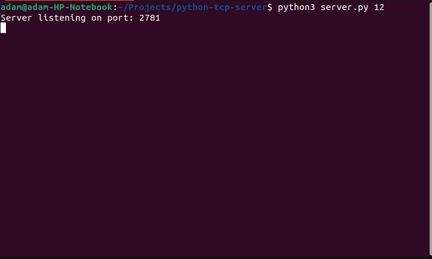
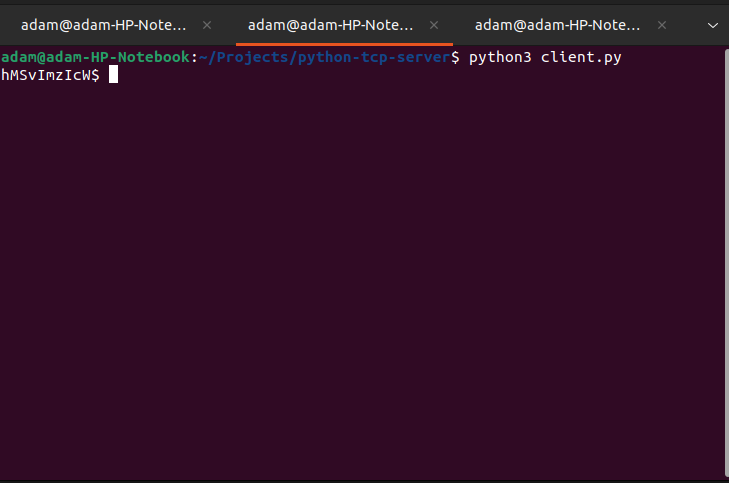

# python-tcp-server

## Description

A multithreaded TCP server that accepts N amount of clients.

The server accepts commands from a client, and uses a linked list to broadcast said command to other connected clients.

Each client connected to the server is ranked on a first come, first serve basis. Commands from higher ranked clients are executed by lower ranked clients. However, commands sent by a lower ranked client will not be executed by a client ranked higher than it.

Whenever a client disconnects, the remaining clients' ranks are reassigned where appropriate.

0 is the highest rank assigned to a client, N is the lowest ranked assigned to a client.

## Technologies Used

- [Python 3.10.6](https://www.python.org/downloads/)

## Challenges Faced

Some of the issues facing the project are;

- Buffering:
  When more that one client is connected, the command isn't immediately received by the sendee(s). 
  A hack to overcome this is to press the enter key in the sendee(s) client(s).

  A client may also 'hang' after the enter key is pressed. To resolve this, send a command from another client.

- 'Lost commands':
  Sending multiple commands in rapid succession results in only the first one being sent.

## Running the project

- Clone this repo to a directory of your choice
- Open up a terminal and cd to the project directory
- To run the server;
  ```bash
  python3 server.py num_of_clients_to_support
  ```
- To run a client, open up a terminal, cd to the project directory and type
  ```bash
  python3 client.py
  ```

## Using the project

Start up the server first before starting up the clients.

#### The server
Upon starting the client, you should come across something similar to the image below.


To close the server, press ctrl+C. Ensure all clients are disconnected before doing this.

#### The client
Upon starting up the client, you should come across something similar to the image below.


After writing a command, you should receive a message afterwards informing you that the command was sent.


If the client is receiving a command from a higher ranked client, you should receive a message saying the command is being executed and a second later, another message saying the command was executed.


if the client is receving a command from a lower ranked client, you should receive a message saying the client cannot execute a command from a lower ranked client.


To disconnect the client from the server, type exit

## Credits

The following resources were used in the creation of this project.
- [Tech with Tim: Python Socket Programming Tutorial](https://www.youtube.com/watch?v=3QiPPX-KeSc)
- [Python documentation](https://docs.python.org/3/)

